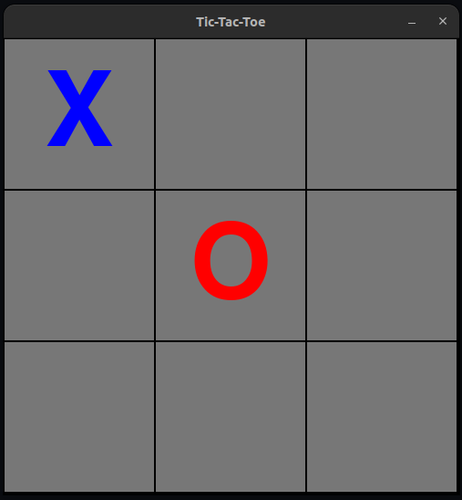

# Tic-Tac-Toe

Python version: $\geq$ 3.10

## Install Dependencies

```
pip install -r requirements.txt
```

## Websocket Server

```
python -m server.server
```

## Websocket Clients

### Human



#### Player 1

```
python -m client.human_client
pygame 2.1.2 (SDL 2.0.16, Python 3.10.4)
Hello from the pygame community. https://www.pygame.org/contribute.html
python -m [client module] join OTTSLMEsH_4OsdOx
python -m [client module] watch pEkWey_bJ1FGEz47
```

#### Player 2

```
python -m client.human_client join OTTSLMEsH_4OsdOx
```

#### Viewers

```
python -m client.human_client watch pEkWey_bJ1FGEz47
```

### AI

#### Player 1

```
python -m client.ai_client
python -m [client module] join OznxKrphQtx-U7wx
python -m [client module] watch 0-ju7REjid--s1h7
```

#### Player 2

```
python -m client.ai_client join OznxKrphQtx
```

## Flexibility

It is also possible for a player to face against an AI.
Just replace `client.ai_client` with `client.human_client` or vise-versa.
